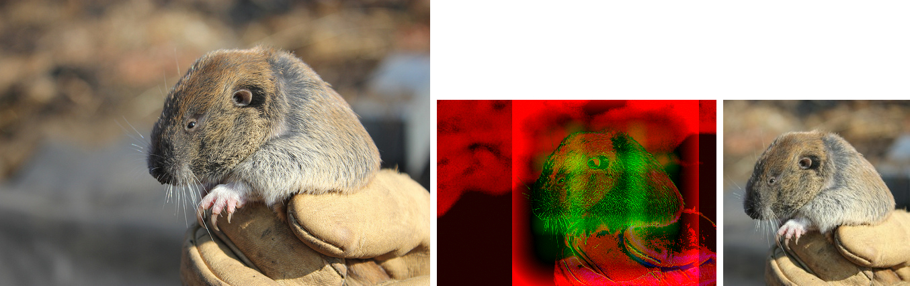

smartcrop.go
============

smartcrop implementation in Go

smartcrop finds good crops for arbitrary images and crop sizes, based on Jonas Wagner's [smartcrop.js](https://github.com/jwagner/smartcrop.js)


Image: [https://www.flickr.com/photos/usfwspacific/8182486789](https://www.flickr.com/photos/usfwspacific/8182486789) CC BY U.S. Fish & Wildlife

## Installation

Make sure you have a working Go environment. See the [install instructions](http://golang.org/doc/install.html).

Additionally you need to have opencv installed. 

You can install it on Mac OS X using
```
brew tap homebrew/science
brew install opencv
```

On linux you need to have following packages installed:
```
libcv-dev libopencv-dev libopencv-contrib-dev libhighgui-dev libopencv-photo-dev libopencv-imgproc-dev libopencv-stitching-dev libopencv-superres-dev libopencv-ts-dev libopencv-videostab-dev 
```

Now you can install smartcrop, simply run:

    go get github.com/muesli/smartcrop

To compile it from source:

    git clone git://github.com/muesli/smartcrop.git
    cd smartcrop && go build && go test -v

## Example
```go
package main

import (
	"github.com/muesli/smartcrop"
	"fmt"
	"image"
	_ "image/png"
	"os"
)

func main() {
	fi, _ := os.Open("test.png")
	defer fi.Close()

	img, _, _ := image.Decode(fi)
	topCrop, _ := smartcrop.SmartCrop(&img, 250, 250)
	fmt.Printf("Top crop: %+v\n", topCrop)
}
```

Also see the test-cases in crop_test.go for further working examples.

## Development
API docs can be found [here](http://godoc.org/github.com/muesli/smartcrop).

Join us on IRC: irc.freenode.net/#smartcrop

Continuous integration: [](http://travis-ci.org/muesli/smartcrop)
